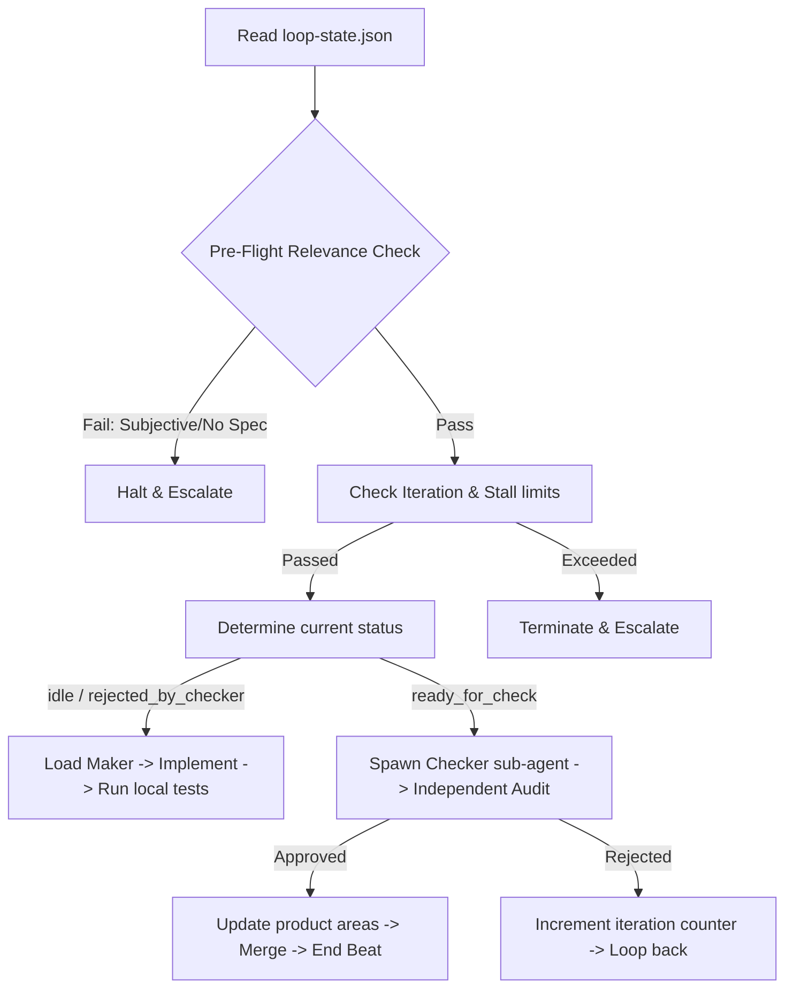

# Workflow: Unattended Loop (Autonomous Execution)

Use this workflow to coordinate headless development cycles, managing state, delegating tasks, and running verification gates automatically.

## Step 0: Pre-Flight Relevance & Scoping Checks
Before taking any action, you MUST verify that this task is safe for headless execution:
1. **Conversational Onboarding (Interactive Trigger Only)**: If you were triggered interactively via chat and `loop-state.json` is uninitialized or blank:
   - Ask the user to define:
     1. The **Goal** (e.g. "Implement OAuth login").
     2. **Max Iterations** (the limit ceiling).
     3. The **Verification Command** (e.g., `npm run test` or `pytest`).
   - Write these values into `loop-state.json`, set `status` to `idle`, and proceed.
2. **Phase Determination**: Detect the project's current state relative to Conductor's 4 native phases (`discovery`, `blueprint`, `execution`, `shipping`). Set the `phase` field in `loop-state.json` accordingly.
3. **The Scoping Barrier (Phase Restriction)**:
   - **Crucial Rule**: Unattended, headless runs are strictly prohibited during the `discovery` (ideation, storyboard, requirement collection) and `blueprint` (high-level specification and planning) phases. These phases require deep empathy, creative design, and direct alignment with human users.
   - If the phase is determined to be `discovery` or `blueprint`, you **MUST halt execution immediately**, print a clear request asking the user to co-author requirements, and decline to run headless until a structured `execution` phase is reached (i.e., a finalized specification and verification test suite exist on the workbench).
4. **Verification Check**: Can success be validated programmatically? (Must compile/test with exit code 0).
5. **Isolation Check**: Is git status clean and workspace isolation supported?

## Step 1: Read and Initialize State
* Load `conductor/1-workbench/loop-state.json`.
* Validate that `iterations.current` is less than `iterations.max_allowed`.
* Increment `iterations.current` by 1.
* Check `telemetry.consecutive_stalls`. If at 3, halt and write to `inbox.md`.

## Step 2: Determine State and Delegate
Analyze the current `status` and `phase` fields in `loop-state.json`.

### Dynamic Persona Selector:
Before starting your role, check the active files and append the matching persona instructions to your system prompt:
- **Scoping / Design Epics**: Append `Product Manager` or `CTO`.
- **Database / Models / SQL**: Append `Database Architect` or `Architect`.
- **UI / Styling / CSS / Components**: Append `Designer` or `Performance Optimizer`.
- **General Code / Logic**: Append `Tech Lead`.
- **Security / Middleware / Auth**: Append `Security Auditor`.

---

### Action Execution Matrix:

* **If `idle` or `rejected_by_checker`**:
  1. Set `status` to `maker_active` and write your worker ID to `current_worker`.
  2. Load the **Maker** persona (plus any specialized persona from the Selector above).
  3. **Execute execution phase work**:
     - Isolate the workspace using the `using-git-worktrees` skill.
     - Execute the **Build** workflow (`workflows/build.md`) following the per-task TDD-Cycle to implement the verified specifications.
  4. Write tool invocation logs to `telemetry`.
  5. Commit changes, set `status` to `ready_for_check`, and update `loop-state.json`.
  6. Stop to conclude the beat.

* **If `ready_for_check`**:
  1. Set `status` to `checker_active` and write your worker ID to `current_worker`.
  2. Spawn an independent sub-agent loading the **Checker** persona (plus any specialized checker persona from the Selector above).
  3. The Checker executes the configured verification command or scans the generated specs.
  4. If tests pass: Set `status` to `passed_by_checker`.
  5. If tests fail: Set `status` to `rejected_by_checker` and append failure details to `history`.
  6. Set `current_worker` to null, save `loop-state.json`, and stop.

* **If `passed_by_checker`**:
  1. Run the `context-updater` skill to sync files in `3-product-areas/` and update `4-context/`.
  2. Merge the branch and clean up worktrees (if in execution).
  3. Log the victory in `conductor/0-compass/ship-log.md`.
  4. Move state through Conductor's physical folders (Folder = State).
  5. If the entire epic is complete: Set `status` to `completed`. Else: transition `phase` to the next logical step and reset `status` to `idle`.
  6. Set `current_worker` to null, save `loop-state.json`, and stop.

## Step 3: Write State and Conclude Beat
* Save the updated `loop-state.json`.
* Output a clean one-line status update so the host runner can capture progress and schedule the next beat.
