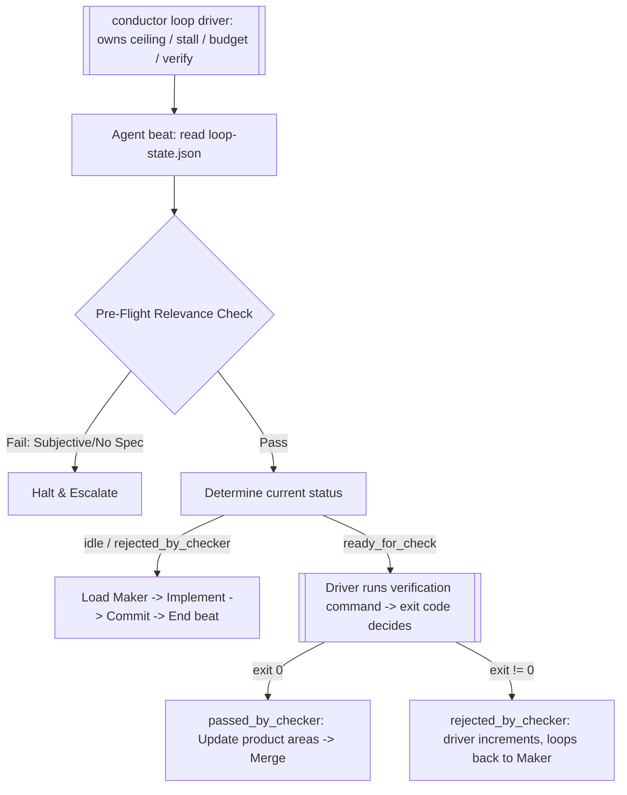

# Workflow: Unattended Loop (Autonomous Execution)

Use this workflow to coordinate headless development cycles, managing state, delegating tasks, and running verification gates automatically.

> The double-boxed nodes are the **deterministic driver's** responsibility, not the agent's. The agent only performs the single-boxed judgment steps each beat.

## Step 0: Pre-Flight Relevance & Scoping Checks

> **Load the guardrails first.** Read `.agents/rules/loop-guardrails.md` now — the iteration ceiling, anti-stall law, and Evidence Rule it defines govern every step below. (This rule is loop-scoped, not always-on, so it must be loaded here.)

Before taking any action, you MUST verify that this task is safe for headless execution:
1. **Conversational Onboarding (Interactive Trigger Only)**: If you were triggered interactively via chat and `loop-state.json` is uninitialized or blank:
   - Ask the user to define:
     1. The **Goal** (e.g. "Implement OAuth login").
     2. **Max Iterations** (the limit ceiling).
     3. The **Verification Command** (e.g., `npm run test` or `pytest`).
   - Write these values into `loop-state.json`, set `status` to `idle`, and proceed.
2. **Phase Determination**: Detect the project's current state relative to Conductor's 4 native phases (`discovery`, `blueprint`, `execution`, `shipping`). Set the `phase` field in `loop-state.json` accordingly.
3. **The Scoping Barrier (Phase Restriction)**:
   - **Crucial Rule**: Unattended, headless runs are strictly prohibited during the **`discovery`** phase (ideation, storyboard, requirement collection). Collecting, empathizing, and defining *what* to build require direct human collaboration to ensure alignment with human intent.
   - The **`blueprint`** phase (technical specification and task slicing) and the **`execution`** phase (code implementation) **CAN run unattended**. Once the human has clarified the goal and requirements, a team of unattended specialist personas (Architect, CTO, Designer, Tech Lead) can design the technical solution, draft spec files (`grand-prd.md`, `technical-vision.md`), and carve out individual tasks without interrupting the human.
   - If the phase is determined to be `discovery`, you **MUST halt execution immediately**, print a clear request asking the user to define the core requirements, and decline to run headless until a clear goal is set.
4. **Verification Check**: Can success be validated programmatically? (Must compile/test with exit code 0).
5. **Isolation Check**: Is git status clean and workspace isolation supported?

## Step 1: Read State (the driver owns the counters)
* Load `conductor/1-workbench/loop-state.json` to learn the current `status`, `phase`, and `goal_description`.
* **Do NOT increment `iterations.current`, and do NOT check or update the stall counter.** When this workflow runs under `conductor loop`, the deterministic driver owns the iteration ceiling, the wall-clock budget, and stall detection — it increments and enforces them between beats, from state deltas you cannot fake. Touching those fields yourself causes double-counting and contradicts the authority model.
* Your job each beat is only the *judgment* for the current `status`: which persona to load and what work to do (below). The driver handles all bookkeeping and gating.

## Step 2: Determine State and Delegate
Analyze the current `status` and `phase` fields in `loop-state.json`.

### Dynamic Persona Selector:
Before starting your role, check the active files and append the matching persona instructions to your system prompt:
- **Scoping / Design Epics**: Append `Product Manager` or `CTO`.
- **Database / Models / SQL**: Append `Database Architect` or `Architect`.
- **UI / Styling / CSS / Components**: Append `Designer` or `Performance Optimizer`.
- **General Code / Logic**: Append `Tech Lead`.
- **Security / Middleware / Auth**: Append `Security Auditor`.

---

### Action Execution Matrix:

* **If `idle` or `rejected_by_checker`** (the Maker's turn):
  1. Load the **Maker** persona (plus any specialized persona from the Selector above). The driver has already stamped `current_worker` for you.
  2. **Execute phase-appropriate work**:
     - *blueprint*: Load the `Architect` or `CTO` persona. Run the blueprinting workflows (`workflows/grand-prd.md`, `ux-ui-design-brief.md`, `technical-vision.md`, or `workflows/carve.md`) to write specifications and slice tasks.
     - *execution*: Isolate the workspace using the `using-git-worktrees` skill and execute the **Build** workflow (`workflows/build.md`) following the per-task TDD-Cycle to implement the specifications.
  3. Commit your changes. If (and only if) you believe the entire goal is now complete, write `conductor/1-workbench/maker-signal.json` with `{ "done": true }` — this is your one positive "done" signal. Do **not** edit `loop-state.json` yourself; the driver owns that file and reads your signal from `maker-signal.json` after the beat (a file the driver can't clobber). The driver still gates the claim behind a green verification + Checker before accepting `completed`.
  4. Stop to conclude the beat. **Do not set `status` yourself** — the driver transitions you to `ready_for_check` and then runs verification.

* **If `ready_for_check`** (the driver's verification gate — Evidence Rule in code):
  1. The **driver** runs the resolved verification command itself and records the exit code. A non-zero exit forces `rejected_by_checker`; a zero exit is necessary but not sufficient.
  2. You do not run verification to decide the verdict — that is the driver's authority. (In a future phase an independent Checker in a separate process reviews green diffs above this floor; until then, a green exit passes.)
  3. Nothing for the agent to write here; the driver owns the transition.

* **If `passed_by_checker`** (advancing):
  1. Run the `context-updater` skill to sync files in `3-product-areas/` and update `4-context/`.
  2. Merge the branch and clean up worktrees (if in execution).
  3. Log the victory in `conductor/0-compass/ship-log.md`.
  4. Move state through Conductor's physical folders (Folder = State).
  5. The driver reads `maker_reported_done`: if set (and verification is green) it finalizes `completed`; otherwise it resets to `idle` for the next task. You do not set the terminal status.

## Step 3: Conclude the Beat
* Save any content you produced (specs, code, commits) and any agent-owned fields you legitimately set (`maker_reported_done`, `history` notes).
* **Leave `status`, `iterations`, `stall`, and `budget` to the driver.** It recomputes progress, enforces the guardrails, and transitions `status` between beats — then schedules the next beat. Output a clean one-line summary of what this beat did so the driver's log stays readable.
