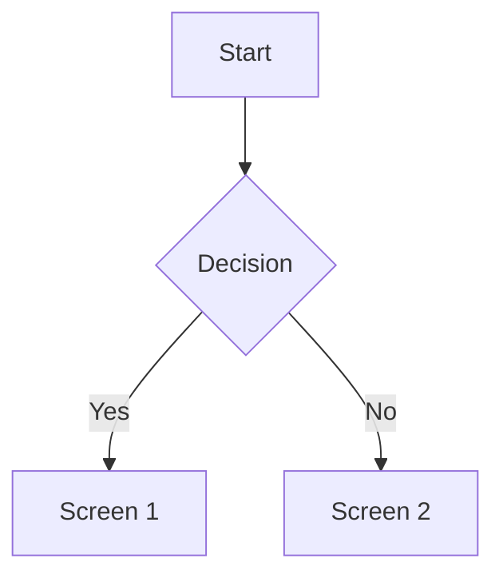

# PRD: [Feature Name]

**Brief Description:**
[1-2 sentences explaining what this is and who it's for. Think of this as the 'Elevator Pitch'.]

<!--
# PRD Template Guide
This document serves as the "Contract of Understanding" between Product (the 'What') and Engineering (the 'How'). It ensures everyone is building toward the same outcome.

## Instructions for Filling This Out:

1. **The Context:** Focus purely on the "Why." Don't describe the solution or features yet. Describe the user's current struggle, why it's a priority now, and what the world looks like once this is fixed.

2. **Key Concepts (Mental Models):** This is the most critical section for AI alignment. Define the "Nouns" of your feature. (e.g., "A 'Credit' represents $1 USD", "A 'Format' is a reusable template"). This prevents the AI from hallucinating incorrect data relationships later.

3. **User Experience (The Flow):** Describe the user's path through the feature.
   - For simple flows: Use a numbered list.
   - For complex logic: Use Mermaid.js syntax (e.g., `graph TD`).
   - Focus on interactions: "User clicks X -> Modal Y appears -> System validates Z."

4. **Epics & Inputs:** Copy/Paste the source Epics from `3-Product-Areas` here. This keeps the execution anchored to the original strategic intent.

5. **Scope Boundaries:** Be ruthless. The "Out of Scope" list is more important than the "In Scope" list. It tells the AI exactly where to stop building to prevent scope creep and technical debt.

6. **Functional Requirements (User Stories):** Use the 'Epic-Decomposer' skill to transform the Epics into specific, testable stories. Each story MUST have binary (Pass/Fail) Acceptance Criteria.

7. **Success Metrics:** Define 1-3 ways we will measure if this was worth building. (e.g., "Reduction in support tickets", "User completes flow in < 30 seconds").
-->

**Status:** Draft
**Owner:** [Name]

---

## 1. The Context
**The Problem:**
*   **Context:** [Why is this a priority right now?]
*   **The Pain:** [What is broken for the user?]
*   **The Goal:** [What does success look like?]

---

## 2. Key Concepts (Mental Models)
*Define the core "Nouns" and logic of this feature. This aligns the AI and Human on the domain model.*

*   **[Concept A]:** [Definition, e.g., "Video Type = Show-level vibe + structure"]
*   **[Concept B]:** [Definition]

---

## 3. User Experience (The Flow)
*Describe the user journey. Use a Mermaid diagram if complex.*

**The Journey:**
1.  User starts at...
2.  User clicks...
3.  System responds with...

---

## 4. Epics & Input Scope
*Copy/Paste the strategic Epics from `Product-Areas` that are being tackled in this PRD.*

### [Area]-E[XX]: [Epic Title]
*   **Problem:** ...
*   **Transformation:** ...

---

## 5. Scope Boundaries
**In Scope (Must Haves):**
*   [ ] [Feature A]
*   [ ] [Feature B]

**Out of Scope (Anti-Goals):**
*   [ ] [Feature X]
*   [ ] [Future Idea Y]

---

## 6. Functional Requirements (User Stories)
*The detailed breakdown. Generated by the `Epic-Decomposer` skill.*

### [Capability/Theme Name]
*   **Story:** [Title]
    *   **As a** [Role] **I want** [Action] **So that** [Benefit]
    *   **Acceptance Criteria:**
        *   [ ] Verify [Happy Path]
        *   [ ] Verify [Edge Case]

---

## 7. Success Metrics
*How do we validate impact?*
*   [ ] [Metric 1]
*   [ ] [Metric 2]